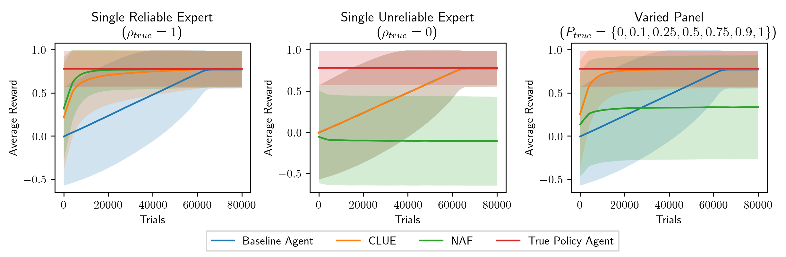

# CLUE for Single-Stage Decision Problems
This repo contains the implementation of CLUE (Cautiously Learning with Unreliable Experts) for Single-Stage Decision Problems, from the paper Learning Who to Trust: Policy Learning in Single-Stage Decision Problems with Unreliable Expert Advice. The CLUE framework allows you to incorporate the advice of multiple, potentially unreliable expert advisors into the Single-Stage Decision Problem loop. CLUE agents can benefit from advice from reliable experts, but are robust against advice from unreliable ones.

## Requirements
This implementation requires Python 3.8.6+, and has several dependencies, listed in [requirements.txt](requirements.txt). To install all dependencies, execute the following command in the main CLUE_SSDP directory.
```setup
pip install -r requirements.txt
```

## Usage
A simple panel comparison experiment on a random environment with 7 state variables and 3 action variables, with default parameters for each agent, run for 10,000 trials for 10 runs can be run using
```panel
python simple_example.py
```
The resulting graphs can be found in the figures directory.

The experiment from Section 4.2. of the paper, titled **Panel Compositions**, can be run using
```panel_comparison
python panel_comparison.py
```
This is a significantly larger experiment (trials = 80,000, runs = 100, |S|=1024, |A|=8) and may take some time to run. These parameters may be changed by editing [panel_comparison.py](panel_comparison.py).

The experiment from Section 4.3. of the paper, titled **Initial Reliability Estimates**, can be run using
```beta_param_test
python beta_param_test.py
```

## Assets Used
The implementations of graphical models, influence diagrams, factors and variable elimination in [PGM.py](CLUE/PGM.py) are adapted from code by David Poole and Alan Mackworth, available [here](https://artint.info/AIPython/), released under a [Creative Commons Attribution-NonCommercial-ShareAlike 4.0 International License](https://creativecommons.org/licenses/by-nc-sa/4.0/deed.en_US).
